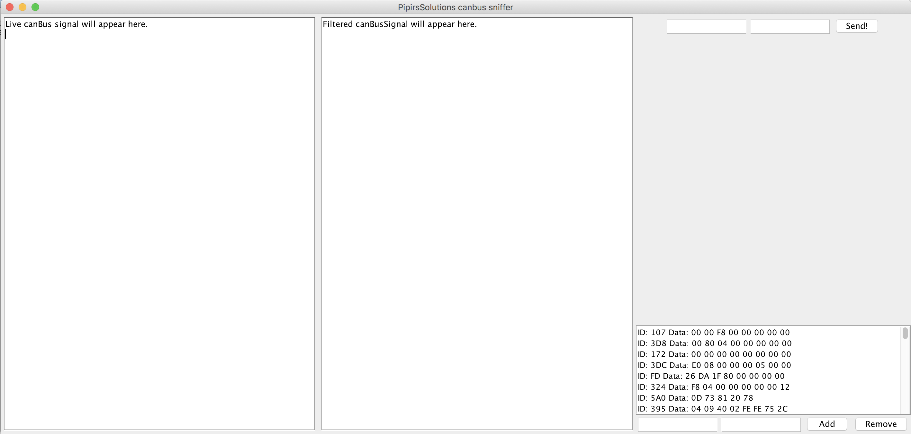

# Canbus-sniffer
Canbus-sniffer

Filters.asc is an example filter file. If you export data then you want it to look like bellow:

The structure needed of messages to filter in filter.asc file is as following:
>T: 14142 ID: 22, Data: 1 E2 1 E2 0 0 0 F0

You can add selction by pushing ``>>`` button to filterlist. or write ``id`` + ``data`` and then add button.

