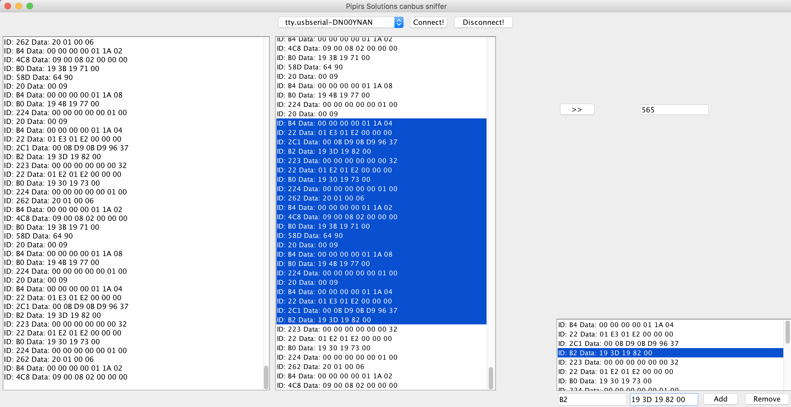

# Canbus-sniffer
Canbus-sniffer

## Compiled version
``https://drive.google.com/open?id=1XDWbQhnP70uFuJZPPf9U-Hgv6lp-syyz``

## Filtering with Filters.asc
At program start it looks for Filters.asc and scans for the data avaiable.

Filters.asc is an example filter file. If you export data then you want it to look like bellow:

The structure needed of messages to filter in filter.asc file is as following:
>T: 14142 ID: 22, Data: 1 E2 1 E2 0 0 0 F0

You can manually copy filterdata from the lists in the program and then format them in sublime for example.

## Adding selections to filterlist
You can add selection from filteredview to filterlist by clicking the ``>>`` button. If you have problems marking ids to filter then just disconnect to pause the data stream, and then reconnect. 

You can also manually add an filtered item in the boxes att the bottom ``id`` + ``data`` and then add button.

## Message counter.
The message counter will appear once you start the program.
Today the software just appends items to the lists, so theres an risk you will run out of memory or that the program will run slower after a while.

## Future development
The software is opensource. You can download and develop yourself if you like.
I however don't have a lot of time to develop on this since I have another job too. Might set up donations in the future so I can focus on it more.
